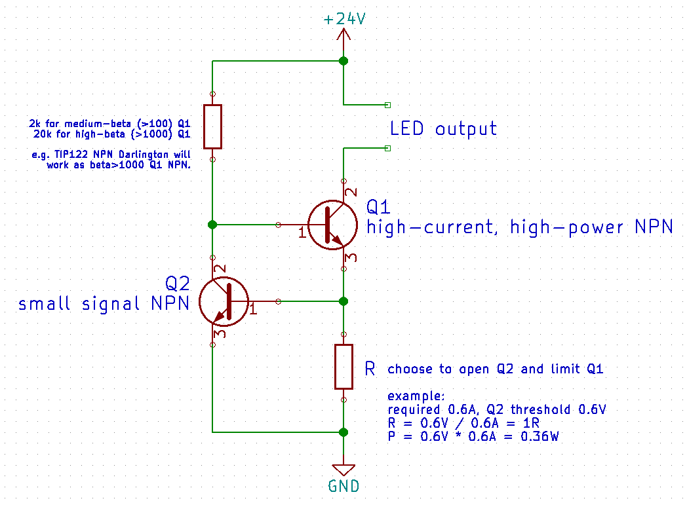
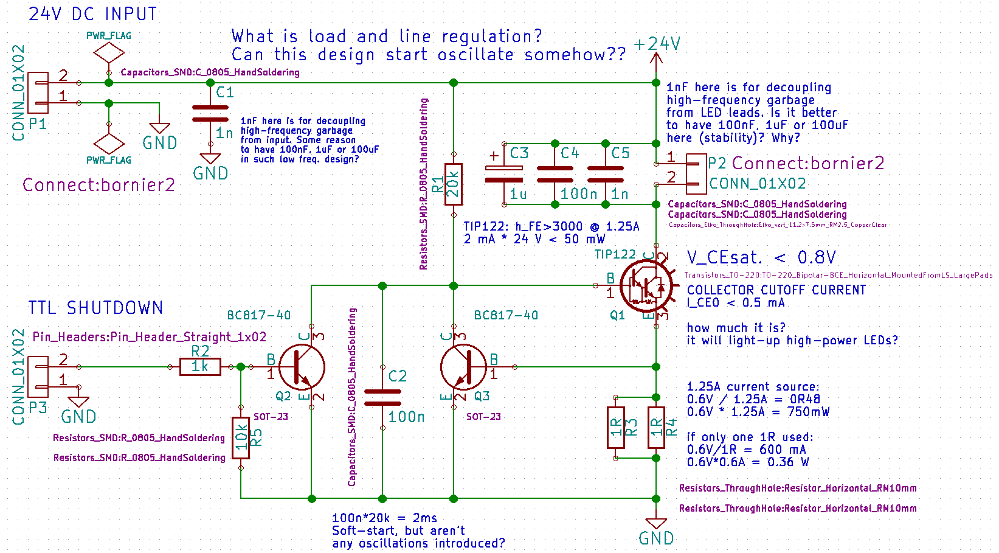
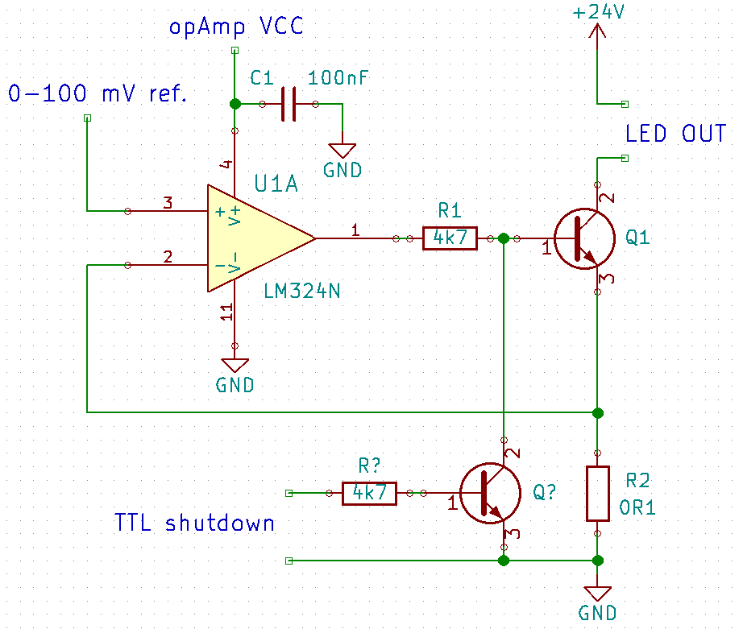
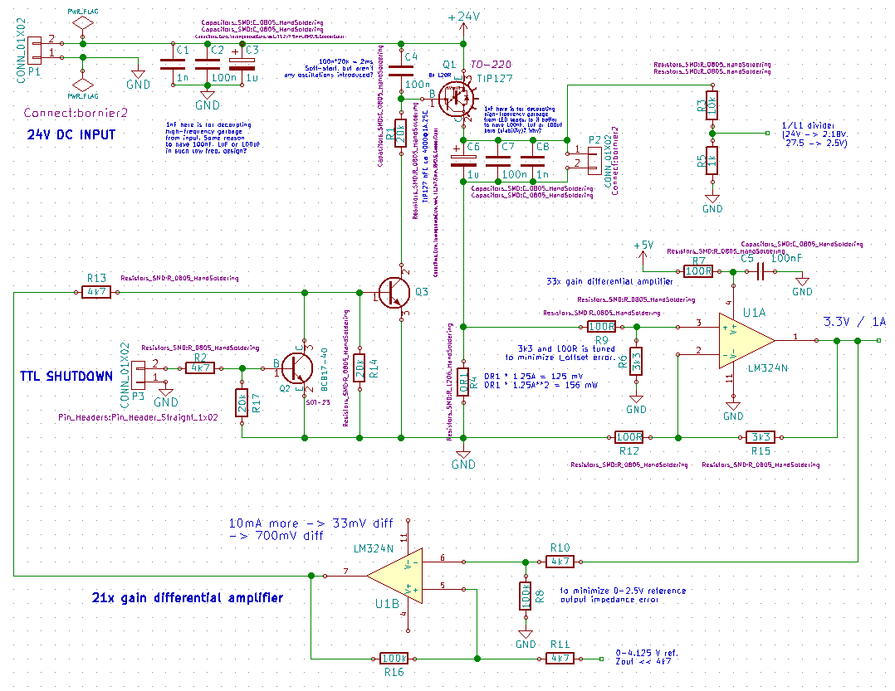
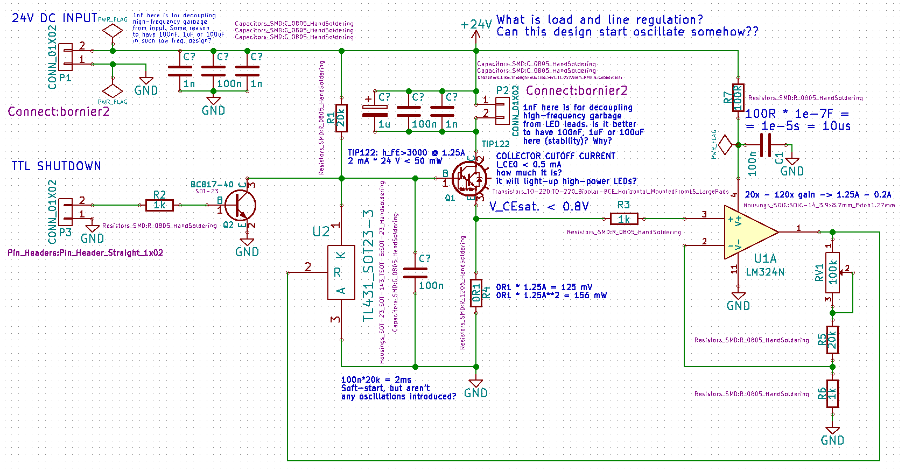
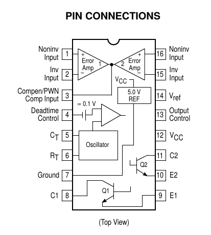
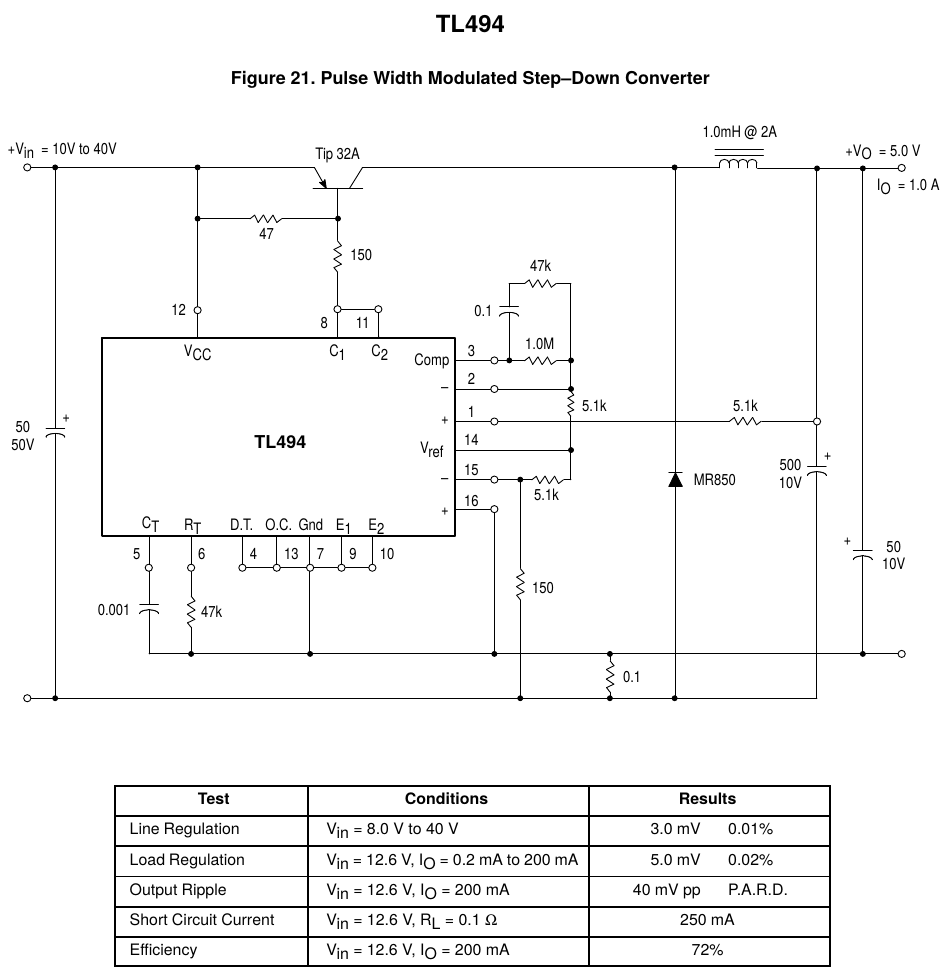
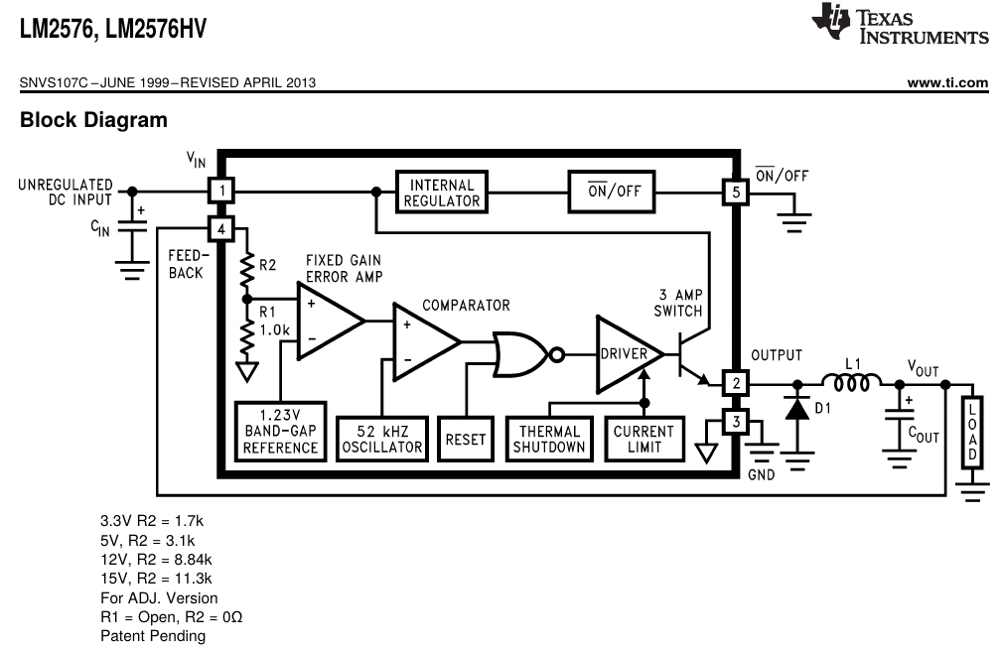
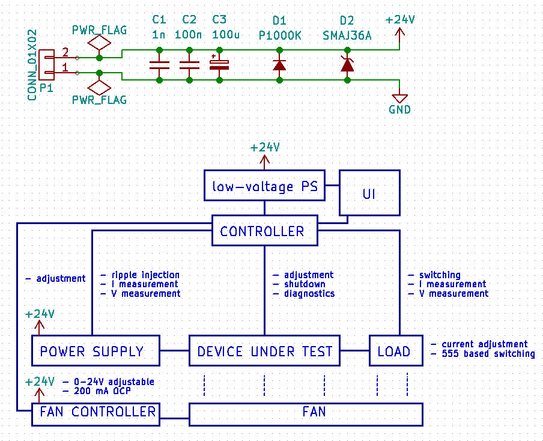

A comparison of current-limiter designs for LED lighting
========================================================
Roman Pavelka <ChaoticRoman@seznam.cz>

Revision history:

1. 2015-04-12, RP: Initial version
2. 2015-04-13, RP: Goals refinement, requirements added.
3. 2015-04-15, RP: requirements modified, commercial designs, designing
4. 2015-04-17, RP: NPN and opAmp designs, test platform
5. 2015-04-20, RP: requirement RM5 added, requirements release 1
5. 2015-04-20, RP: requirement review and modifications

Statement of Work
-----------------
The aim of this effort is to choose simple and reliable LED driver design.
Both linear and switched mode-power supplies (SMPS) circuits and commercial
modules should be considered ranging from simple linear NPN transistor
fixed-current driver to digitally controlled buck and boost SMPS topologies.
LED driver is to be used in multi-channel configuration and design should
emphasize reliability, efficiency, output ripple, price and size. Input
voltage should include 24V DC for safety and reasonable efficiency.

Requirements Specification
--------------------------

### Functional Requirements

* RF1: Proposed devices should be able to operate from adjustable 12-32V DC
power supply of parameters of Meanwell RS-150-24 power supply but additional
small linear power supplies are allowed.
* RF2: Proposed devices should deliver current-limited DC adjustable up to 1.25A
to the single load.
* RF3:  Device shall feature shutdown i.e. high power LED is OFF even in darkness
for naked eye. Shutdown should be commanded by TTL signal.

### Mission Requirements

* RM1: Commercial LED-drivers should be evaluated.
* RM2: Linear and SMPS topologies should be designed and studied, at least:
    - linear transistor-based LED driver
    - linear LED driver based on operational amplifiers
    - switched LED driver based on buck non-isolated SMPS topology.
* RM3: The report to be delivered shall describe compared solutions, parameters
       of interest are:
    - input voltage range
    - over-current protection (OCP)
    - safe operating area
    - thermal protection
    - inrush current
    - failure modes, reliability
    - current rating
    - efficiency
    - line and load regulation
    - over-voltage protection
    - output voltage/current adjustment
    - input/output voltage/current diagnostics
    - price
    - size
* RM4: Single design should be chosen, tested and characterized. KiCad schematics
and example layout, BOM, budget and proof-of-concept self-consistent 6-channel device
shall be delivered.
* RM5: Test tools for measurement of inrush current, current rating, regulation,
efficiency and possible adjustment and diagnostics precision, uniformity and stability
should be designed, constructed and verified.

<!--### Physical requirements

* RD1: Single channel module shall be limited in dimensions by 40mm x 15mm x 10mm.-->

System Concept
--------------

### Linear Regulators

#### NPN-based regulator

This is basic idea of NPN current regulator

* Very simple and very cheap.
* Short circuit leads to catastrophic Vin*Iout power dissipation, complex to solve.
* Minimal sensing value ca 0.5V means 0.5W@1A loss here.
* Adjustment is quite difficult.
* Can be tuned for efficiency>90% for very similar voltages in all channels
  but only in range of current setting dependent of main DC power supply adjustment.

Simple design to study stability of linear designs is presented in following figure.
Basic questions aim proper values of capacitors on input (stability vs. inrush current)
and output (voltage vs. current stability). Effect of intended soft-start capacitor C2
should be tested and verified. Current regulation and its spread for different Q3 NPNs
should be studied. Failure modes and line/load regulation shall be studied.

 
#### Operational amplifier based regulator

This is basic idea of Operational amplifier based current regulator, but such naive implementation
will suffer of horrible error from ground voltage differences.

Following design use one differential amplifier for current sensing, another differential amplifier
for current setting and improved output stage for simpler voltage diagnostics.

* Simple, cheap, efficient.
* Short circuit leads to catastrophic Vin*Iout power dissipation, can be solved
  by diagnostics and digital shutdown.
* Sensing value ca 100mV means 100mW@1A loss here, OK for 1% 1206 1/4W resistor.
* Adjustment is simple by potentiometer, trimmer or DAC.
* Can be tuned for efficiency>90% for very similar voltages in all channels
  and only range of intensity settings.

<!-- BAD IDEA to not use differential amplifier
If Collector-Emitter voltage of transistor in TL431 programmable reference is less than 500mV (it is not specified in
TL431 datasheet), then TL431 can serve as comparator as in following circuit.

-->

### Switched-mode power supplies circuits

<!--Important thing to note for boost converter is need to limit maximal
output voltage and to prevent coil saturation (by proper coil reset).-->

#### TL494 step-down and step-up SMPS based solutions

TL494 is basic SMPS chip usable in many different SMPS topologies. TL494 is used in many
desktop-computer power supplies.

Buck circuit from datasheet.

P.A.R.D. = Periodic and Random Deviation noise

#### LM2576T based solutions

LM2576T is 50 kHz integrated solution available for well-under 1$ per piece.

### Commercial SMPS modules to be explored

Following commercial SMPS modules should be evaluated:

* Meanwell [LDD-1000L](http://www.mouser.com/ProductDetail/Mean-Well/LDD-1000L/?qs=sGAEpiMZZMt5PRBMPTWcaRgaVnaXJTVtYzeCn%2f%252bnvqOhpAqVGeWTIA%3d%3d)
* Chinese drivers based on LM2596S available on ebay:
    - [currrent-adjustable module](http://www.ebay.com/itm/LM2596-DC-DC-Step-down-LED-Driver-Adjustable-Power-Supply-Module-Converter-/131219116497?pt=LH_DefaultDomain_3&hash=item1e8d44d1d1)
    - [voltage/current/indication adjustable module](http://www.ebay.com/itm/LED-New-Driver-DC-DC-Step-down-Adjustable-CC-CV-Power-Supply-Module-1PC-LM2596-/141524043875?pt=LH_DefaultDomain_15&hash=item20f37d8863)

### Test tools

Test platform should be able to provide 24V input voltage, shutdown signal,
adjustment PWM and analog signal and test load. Signal injection to input
voltage and load switching should be possible with adjustable frequency
and amplitude. UI should be independent on Personal computer. There should
be place to accommodate device under test, namely its power transistor
and an appropriate fan. The device shall feature over-current protection.

Detailed design
---------------
#### Operational Amplifier based regulators

    
### Switched-mode power supplies circuits

#### TL494 based solution
#### LM2576T based solution

### Test platform
